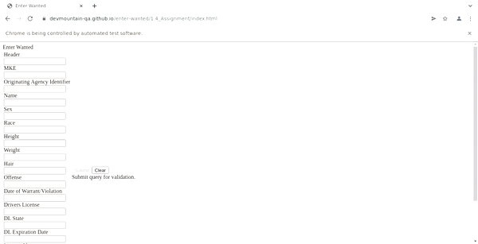

<p>Automated tests using Selenium, Jest, and Typescript for:</p> <a>https://devmountain-qa.github.io/enter-wanted/1.4_Assignment/index.html</a>

</img>

---------------------------------------------------------
<br/>
<h2>Installation:</h2>

```console
$ npm i
```

<h2>Run tests:</h2>

```console
$ npx jest enterWantedTests
```

<h3>Test plan: </h3>


https://dmutah.atlassian.net/browse/DH6DL-33

<h3>Test cases:</h3>

https://dmutah.atlassian.net/browse/DH6DL-34<br/>
https://dmutah.atlassian.net/browse/DH6DL-35<br/>
https://dmutah.atlassian.net/browse/DH6DL-36<br/>
<hr/><br/>

<h3>Features Tested:</h3>

1. Header: Required, 9-19 characters in length, any allowed. <b>Equivalence Partitions: 0-8, 9-19, 20-30</b>

2. MKE: Required, 2-4 in length, alphabetical or special characters allowed.<b>Equivalence Partitions: 0-1, 2-4, 5-10</b>

3. Name: Required, 1-30 characters in length, any allowed.<b>Equivalence Partitions: 0, 1-30, 31</b>

4. Hair: Required, 3-10 characters in length, alphabetical only. <b>Equivalence Partitions:0-2, 3-10, 11-30</b>


